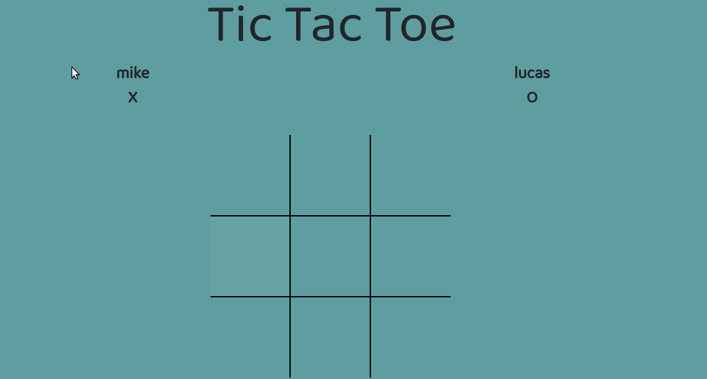

  

 

  

  <h3 align="center">Javascript TicTacToe game  </h3>

  

    

 
  <a href="https://github.com/lucasmazo32/jstic-tac-toe/tree/feature/jtictactoe"><strong>Explore the docs »</strong></a>
 
  
  
--
    <a href="https://github.com/lucasmazo32/jstic-tac-toe/issues  ">Request Feature</a>
  

<!-- TABLE OF CONTENTS -->
## Table of Contents

* [About the Project](#about-the-project)
* [Built With](#built-with)
* [Getting Started](#getting-started)
* [Contributing](#contributing)
* [License](#license)
* [Contact](#contact)
* [Acknowledgements](#acknowledgements)

<!-- ABOUT THE PROJECT -->
## About The Project

The classic tic tac toe game made from scratch with Javascript. 

----
This is the secpnd collaborative project on the "Ruby on Rails" path from the Microverse FullStack web developer curriculum

 
 
For more details about the Project and it's requirements go to <a href="https://www.theodinproject.com/courses/javascript/lessons/tic-tac-toe-javascript"> The Odin Project</a>

### Built With

* [JAVASCRIPT](https://www.javascript.com/)
* [BOOTSTRAP](https://www.getbootstrap.com/)

<!-- GETTING STARTED -->
## Getting Started

To get a local copy up and running follow these simple steps.

Clone or fork the repo <https://github.com/lucasmazo32/jstic-tac-toe/tree/development>

<!-- CONTRIBUTING --> 
## Contributing

Contributions are what make the open source community such an amazing place to be learn, inspire, and create. Any contributions you make are **greatly appreciated**.

1. Fork the Project
2. Create your Feature Branch (`git checkout -b feature/AmazingFeature`)
3. Commit your Changes (`git commit -m 'Add some AmazingFeature'`)
4. Push to the Branch (`git push origin feature/AmazingFeature`)
5. Open a Pull Request

<!-- LICENSE -->
## License

No licenses required as project was developed in educational eviroment.

<!-- CONTACT -->
## Contact

Lucas Mazo - [@lucasmazo32](https://twitter.com/lucasmazo32)
Luis Puente - [@mkezmkez](https://twitter.com/mkezkmez)

<!-- ACKNOWLEDGEMENTS -->
## Acknowledgements

* [LUIS PUENTE](https://github.com/mkezmkez)
* [LUCAS MAZO](https://github.com/lucasmazo32)
